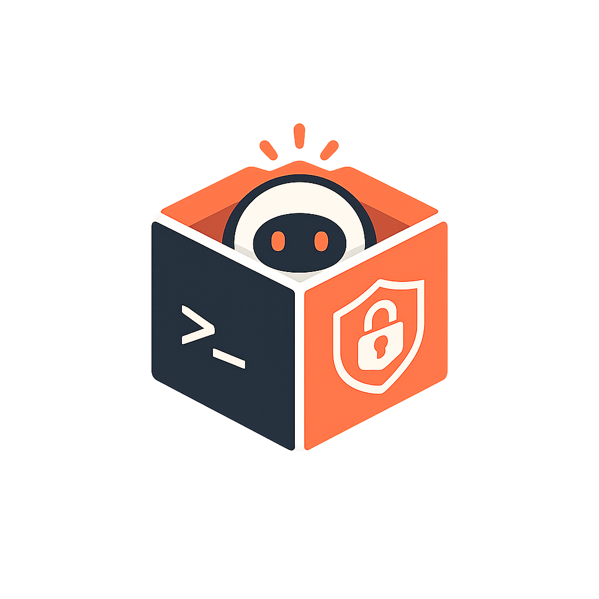

# 📦 clabox

[](https://github.com/lskjs)
[](https://www.npmjs.com/package/clabox)
[](https://www.npmjs.com/package/clabox)
[](https://www.npmjs.com/package/clabox)
[](https://www.npmjs.com/package/clabox)
[](https://github.com/ycmds/clabox/blob/main/LICENSE)
[](https://t.me/isuvorov)

<div align="center">
  <h3><p><strong>🛡️ Run Claude Code in a sandbox for super-safe YOLO mode 🛡️</strong></p></h3>
</div>



**🛡️ Tight Seatbelt sandbox** — the profile starts with `(deny default)` <br/>
**📂 Project-scoped access** — only the CWD and explicitly allowed paths <br/>
**🔒 Secrets stay out of reach** — SSH keys, `~/.aws`, `~/.ssh/id_*`, private dirs <br/>
**📦 Declarative JS config** instead of sed surgery over a heredoc <br/>
**🤖 Bot identity** for git/ssh inside the sandbox <br/>
**🧨 Fork-bomb guard** via `ulimit -u` <br/>
**⚡ YOLO mode, safely** (`--dangerously-skip-permissions`) <br/>
**🍎 macOS only**, Node ≥ 18, no runtime deps beyond `yargs` <br/>

---

## Install

```bash
npm install -g clabox      # exposes the global `clabox` command
# or run without installing:
bunx clabox …
npx clabox …
```

## Usage

```bash
# Default profile (~/.claude), YOLO mode
clabox run --dangerously-skip-permissions

# A different Claude profile
CLAUDE_CONFIG_DIR=~/.claude_work clabox run --dangerously-skip-permissions

# A named box from ~/.config/clabox/configs/<name>.config.mjs
clabox -b ax-root --dangerously-skip-permissions

# Debugging
clabox generate            # build the profile, print the .sb path
clabox profile             # just the path (no build)
CLABOX_DEBUG=1 clabox      # print profile/config/dir on launch
clabox --help
```

Unknown flags are passed straight through to `claude`, so anything after the
command (`--dangerously-skip-permissions`, `--model …`, etc.) just works.

---

## Configuration

Three layers, later wins: **defaults → environment variables → JS config file**.

The config file is looked up in this order: `--config /path` →
`CLABOX_CONFIG=/path` → `./clabox.config.mjs` (project root) →
`~/.config/clabox/config.mjs`.
See [`clabox.config.example.mjs`](clabox.config.example.mjs).

```bash
clabox --config ./my.clabox.mjs run --dangerously-skip-permissions
```

```js
// clabox.config.mjs
export default {
  configDir: '~/.claude_work',
  bot: { name: 'workBOT', email: 'bot@work.dev', sshDir: '~/.ssh/workbot' },
  network: true,
  paths: {
    readWrite: ['~/scratch'],    // RW on top of project / configDir / tmp
    readOnly:  ['~/reference'],   // RO
    exec:      ['/opt/tool/bin'], // process-exec
    deny:      ['~/secret'],      // explicit deny (read + write)
  },
};
```

You may also export a function `(defaults) => config` for full control. `~` is
expanded to `$HOME`.

### Named boxes (`-b` / `--box`)

Keep a directory of named configs and switch between them by name from anywhere:

```bash
# ~/.config/clabox/configs/ax-root.config.mjs
clabox -b ax-root --dangerously-skip-permissions
```

`-b <name>` resolves `~/.config/clabox/configs/<name>.config.mjs` (falling back
to a bare `<name>.mjs`) and loads it like `--config` — so it wins over `--config`
/ `CLABOX_CONFIG`. Override the dir with `CLABOX_CONFIGS_DIR`. Files named
`_*.mjs` are treated as shared partials (e.g. `_presets.mjs`), not boxes.

`-b` also accepts a path, so a repo can carry its own box configs:

```bash
clabox -b ./boxes/vibe.mjs   # an explicit config file (any ref ending in .mjs)
clabox -b ./boxes/vibe       # box `vibe` inside ./boxes (same .config.mjs/.mjs lookup)
```

A box can pin its own `cwd` so it always targets one project, no matter where you
run `clabox` from:

```js
// ~/.config/clabox/configs/ax-root.config.mjs
export default {
  cwd: '~/projects/my-app', // claude runs here; this dir is the RW project dir
  configDir: '~/.claude_axiomus',
};
```

### Environment variables

| Variable | Purpose | Default |
|---|---|---|
| `CLAUDE_CONFIG_DIR` | Claude config/profile dir (multi-account); passed through to `claude` | `~/.claude` |
| `CLABOX_CLAUDE_BIN` | path to the `claude` binary | `PATH`, then `~/.local/bin/claude` |
| `CLABOX_BOT_NAME` / `CLABOX_BOT_EMAIL` | git identity | `claudeBOT` / `bot@example.com` |
| `CLABOX_BOT_SSH_DIR` | bot key dir (`id_ed25519`, `config`) | `~/.ssh/claudebot` |
| `CLABOX_CONFIG` | path to the JS config file (the `--config` flag overrides it) | — |
| `CLABOX_CONFIGS_DIR` | global dir of named boxes for `-b`/`--box <name>` (`<name>.config.mjs`) | `~/.config/clabox/configs` |
| `CLABOX_CWD` | working dir to run `claude` in (also the RW project dir); `~` expanded | — (the shell CWD) |
| `CLABOX_DEBUG` | print diagnostics on launch | — |
| `TMPDIR` | where the generated profile is stored | `/tmp` |

---

## How it works

`sandbox-exec` runs a process inside a Seatbelt profile that starts with
`(deny default)` — everything is forbidden unless explicitly allowed.

```
clabox run  →  loadConfig()  →  buildProfile()  →  <TMPDIR>/…sb
            →  sh -c 'ulimit -u N; exec sandbox-exec -f <sb> env … claude …'
```

| Module | Responsibility |
|---|---|
| `src/utils/config.ts` | defaults, env, loading/merging the JS config, `~` expansion |
| `src/sandbox/profile.ts` | assembling the SBPL profile from config (typed helpers `subpath`/`literal`/`regex`/…) |
| `src/sandbox/run.ts` | locating `claude`/`sandbox-exec`, generating the profile, launching with bot env + `ulimit` |
| `src/cli.ts` | the CLI (`run` / `generate` / `profile`), built on yargs |

Profile path: `$TMPDIR/clabox-<dir-name>-<hash>.sb` (hash of the absolute
project path — each project gets its own cached profile).

Package managers are autodetected (`src/sandbox/profile.ts`) and added to the
read/exec sections: Homebrew (`/opt/homebrew` or `/usr/local/Homebrew`),
`~/.local`, Nix (`/nix/store`).

### What the profile allows and denies

**Read-only:** system dirs `/System`, `/usr`, `/bin`, `/sbin`,
`/Library/Frameworks`, Command Line Tools / Xcode, tzdata, system and user
`Library/Preferences`, detected package paths.

**Read-write:** the project dir (CWD), the Claude config dir (`configDir`),
`/tmp`, `/private/tmp`, `/private/var/folders/…`, `~/Library/Keychains` (for
OAuth refresh), plus `paths.readWrite` from your config.

**Network:** `(allow network*)` when `network: true` (the default).

**Explicit deny — wins even over the allows above:**
- private dirs: `denyHome` (`~/Documents`, `~/Desktop`, `~/Downloads`,
  `~/Pictures`, `~/Movies`, `~/Music`);
- secrets: `denyDotConfigs` (`~/.aws`, `~/.gnupg`, `~/.kube`, `~/.docker`,
  `~/.config`) with a carve-out for `~/.config/git`;
- personal SSH keys `~/.ssh/id_*`, `*.pem`, `*.key` — Claude physically cannot
  read them. Only the bot key subdir (`bot.sshDir`) is readable.

### Git/ssh bot identity

- `ulimit -u <ulimitProcs>` — fork-bomb guard (`0` to disable);
- `GIT_AUTHOR_*` / `GIT_COMMITTER_*` — bot name/email from config;
- if `bot.sshDir/id_ed25519` exists, `GIT_SSH_COMMAND` is pinned to it
  (`IdentitiesOnly=yes`, `IdentityAgent=none`);
- gpg signing disabled, `NPM_CONFIG_USERCONFIG=/dev/null`, `DISABLE_AUTOUPDATER=1`.

---

## Tests

```bash
bun test            # unit + functional (bun:test)
bun run test        # full gate: lint + types + unit + size
```

The suite tests the wrapper, not `claude`:

- **Unit** — the generated profile text: SBPL preamble, project RW/exec, network
  toggle, config dir, ssh-key denials, the deny list, extra config paths, hooks.
- **Functional** — runs real `sandbox-exec` against a generated profile and
  asserts that reads/writes inside the project succeed while denied paths are
  blocked. Auto-skipped off macOS or when running nested inside another sandbox.

---

## Limitations

- **macOS only** — needs `sandbox-exec` (Seatbelt). Formally deprecated, still
  works on macOS 14/15.
- **No nested sandbox** — you cannot launch the sandbox from inside another
  sandbox (`sandbox_apply: Operation not permitted`). Run from a bare host.
- **Keychain is writable** for OAuth refresh (otherwise tokens hit 401 after
  ~24h). For a stricter setup, swap the RW Keychain block for RO in
  `src/sandbox/profile.ts` (the "Keychain access" section).

---

## License

[MIT](LICENSE)
