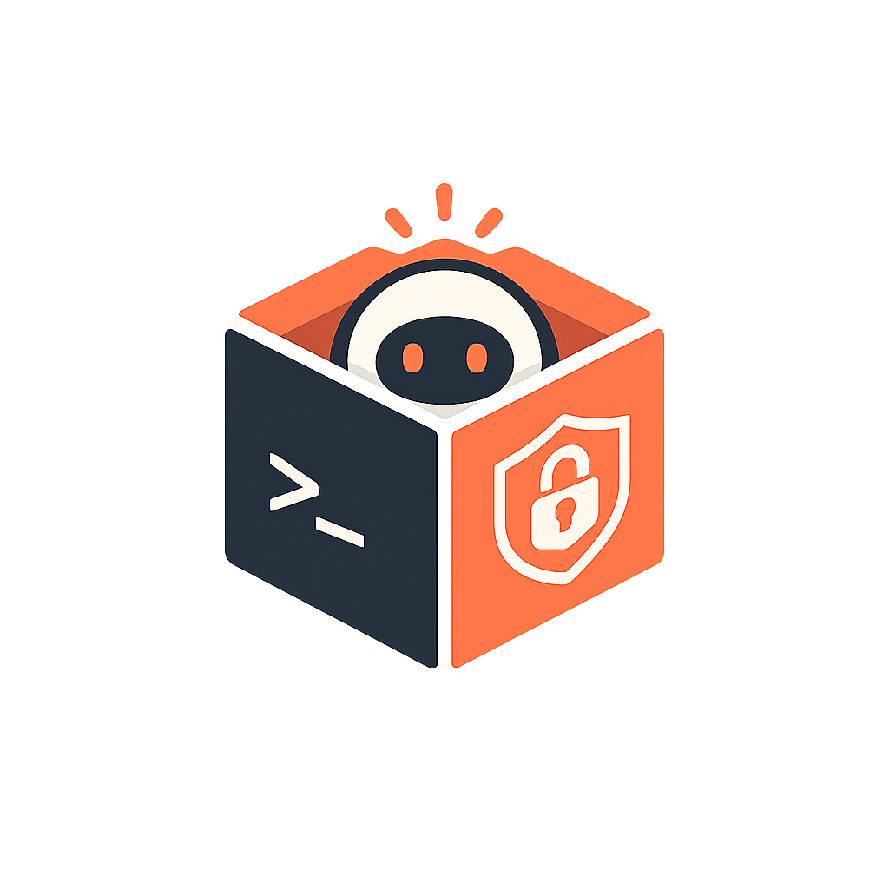

# 📦 clabox

[](https://github.com/lskjs)
[](https://www.npmjs.com/package/clabox)
[](https://www.npmjs.com/package/clabox)
[](https://www.npmjs.com/package/clabox)
[](https://www.npmjs.com/package/clabox)
[](https://github.com/ycmds/clabox/blob/main/LICENSE)
[](https://t.me/isuvorov)

<div align="center">
  <h3><p><strong>🛡️ Run Claude Code in a sandbox for super-safe YOLO mode 🛡️</strong></p></h3>
</div>



**🛡️ Tight Seatbelt sandbox** — the profile starts with `(deny default)` <br/>
**📂 Project-scoped access** — only the CWD and explicitly allowed paths <br/>
**🔒 Secrets stay out of reach** — SSH keys, `~/.aws`, `~/.ssh/id_*`, private dirs <br/>
**📦 Declarative JS config** instead of sed surgery over a heredoc <br/>
**🤖 Bot identity** for git/ssh inside the sandbox <br/>
**🧨 Fork-bomb guard** via `ulimit -u` (headroom over the running process count) <br/>
**⚡ YOLO mode, safely** (`--dangerously-skip-permissions`) <br/>
**🔔 Notifications that survive the sandbox** — via terminal escapes, not mach services <br/>
**🪟 Ghostty integration** — per-box apps, `clabox tab`, clipboard-read denied <br/>
**🍎 macOS only**, Node ≥ 18, no runtime deps beyond `yargs` <br/>

---

## Install

```bash
npm install -g clabox      # exposes the global `clabox` command
# or run without installing:
bunx clabox …
npx clabox …
```

## Usage

```bash
# Default profile (~/.claude), YOLO mode
clabox run --dangerously-skip-permissions

# A different Claude profile
CLAUDE_CONFIG_DIR=~/.claude_work clabox run --dangerously-skip-permissions

# A named box from ~/.config/clabox/configs/<name>.config.mjs
clabox -b ax-root --dangerously-skip-permissions

# Remote Control (/rc): start the daemon OUTSIDE the sandbox — see below
clabox -b ax daemon --detach

# Per-tab env override: KEY=VALUE sets, a bare KEY unsets
clabox -b ax-mg --rc                     # this tab gets feature flags (and /rc)
clabox -b ax-mg -e DISABLE_TELEMETRY     # …or unset just one var by hand
clabox -b ax-mg -e GH_TOKEN=ghp_…        # this tab only

# Open a box in the terminal you're already in (Ghostty)
clabox -b ax-mg tab --split right

# Debugging
clabox generate            # build the profile, print the .sb path
clabox profile             # just the path (no build)
CLABOX_DEBUG=1 clabox      # print profile/config/dir on launch
clabox --help
```

Unknown flags are passed straight through to `claude`, so anything after the
command (`--dangerously-skip-permissions`, `--model …`, etc.) just works.

---

## Configuration

Three layers, later wins: **defaults → environment variables → JS config file**.

The config file is looked up in this order: `--config /path` →
`CLABOX_CONFIG=/path` → `./clabox.config.mjs` (project root) →
`~/.config/clabox/config.mjs`.
See [`clabox.config.example.mjs`](clabox.config.example.mjs).

```bash
clabox --config ./my.clabox.mjs run --dangerously-skip-permissions
```

```js
// clabox.config.mjs
export default {
  configDir: '~/.claude_work',
  bot: { name: 'workBOT', email: 'bot@work.dev', sshDir: '~/.ssh/workbot' },
  network: true,
  paths: {
    readWrite: ['~/scratch'],    // RW on top of project / configDir / tmp
    readOnly:  ['~/reference'],   // RO
    exec:      ['/opt/tool/bin'], // process-exec
    deny:      ['~/secret'],      // explicit deny (read + write)
  },
};
```

You may also export a function `(defaults) => config` for full control. `~` is
expanded to `$HOME`.

### Named boxes (`-b` / `--box`)

Keep a directory of named configs and switch between them by name from anywhere:

```bash
# ~/.config/clabox/configs/ax-root.config.mjs
clabox -b ax-root --dangerously-skip-permissions
```

`-b <name>` resolves `~/.config/clabox/configs/<name>.config.mjs` (falling back
to a bare `<name>.mjs`) and loads it like `--config` — so it wins over `--config`
/ `CLABOX_CONFIG`. Override the dir with `CLABOX_CONFIGS_DIR`. Files named
`_*.mjs` are treated as shared partials (e.g. `_presets.mjs`), not boxes.

`-b` also accepts a path, so a repo can carry its own box configs:

```bash
clabox -b ./boxes/vibe.mjs   # an explicit config file (any ref ending in .mjs)
clabox -b ./boxes/vibe       # box `vibe` inside ./boxes (same .config.mjs/.mjs lookup)
```

A box can pin its own `cwd` so it always targets one project, no matter where you
run `clabox` from:

```js
// ~/.config/clabox/configs/ax-root.config.mjs
export default {
  cwd: '~/projects/my-app', // claude runs here; this dir is the RW project dir
  configDir: '~/.claude_axiomus',
};
```

### Per-tab env overrides (`-e` / `--env`)

`-e KEY=VALUE` sets a variable for one launch; a **bare `-e KEY` unsets** it
(`env -u KEY`) — the only way to drop something a shared preset or your login
shell exported. Repeatable, and it wins over the box's own `env`. In a config
file the same thing is a `null`:

```js
export default {
  env: { GH_TOKEN: process.env.MY_TOKEN, DISABLE_TELEMETRY: null }, // null = unset
};
```

The case that motivated it: claude turns **feature-flag fetching** off when
`DISABLE_TELEMETRY`, `DO_NOT_TRACK`, `DISABLE_GROWTHBOOK` or
`CLAUDE_CODE_DISABLE_NONESSENTIAL_TRAFFIC` is set, and with fetching off you
lose Remote Control (`/rc`), auto mode by default, cross-machine session
messaging, `/import`, `/skill-doctor` and more ([docs][ff]). The first three
count **any non-empty value** — `0` and `false` included — so only an unset
brings the features back. One box, two kinds of tab:

```bash
clabox -b ax-mg                        # private: telemetry off, no /rc
clabox -b ax-mg --rc                   # flags on: /rc available
```

`--rc` is shorthand for unsetting **all four** blockers at once
(`CLAUDE_CODE_DISABLE_NONESSENTIAL_TRAFFIC`, `DISABLE_TELEMETRY`, `DO_NOT_TRACK`,
`DISABLE_GROWTHBOOK`) — any single one, from the box `env`, your login shell or a
`settings.json` `env` block, is enough to block the fetch, so clearing only the
one you remember setting looks like it didn't help. An explicit `-e KEY=VALUE`
after `--rc` still wins.

A `--rc` tab also **looks** different, since the two kinds of tab are otherwise
identical: the title gets a badge (`📡 RC ~/projects/app`), the terminal
background is repainted (OSC 11 — on macOS Ghostty that's literally the tab's
color) and the cursor turns amber (OSC 12), all reset when claude exits. Tune or
disable it per box — or machine-wide with `CLABOX_TAB_RC_BACKGROUND=` /
`CLABOX_TAB_RC_CURSOR=` (empty = off):

```js
export default {
  tab: {
    title: null,             // fixed tab title; null → the project dir (~-shortened)
    rcBadge: '📡 RC',        // prefixed to the title while --rc is on; null → none
    background: null,        // this box's background, e.g. '#0d1117'; null → untouched
    rcBackground: '#5c1a00', // background for a --rc tab; null → fall back to `background`
    cursor: null,            // this box's cursor color; null → untouched
    rcCursor: '#ff8c1a',     // cursor for a --rc tab; null → fall back to `cursor`
    foreground: null,        // text color; null → untouched (same rc pairing)
    rcForeground: null,
  },
};
```

Background **and** cursor on purpose: a window with `background-opacity`/blur
washes the background out, while a small blinking cursor stays obvious.
Foreground is off by default — repainting all the text is the one knob that can
hurt readability. Colors are `#rgb` / `#rrggbb` / an X11 name, and are only
written onto a real TTY. Note claude rewrites the terminal title as it works
(unless the box exports `CLAUDE_CODE_DISABLE_TERMINAL_TITLE`), so the colors are
the durable marker and the badge is a hint.

[ff]: https://code.claude.com/docs/en/env-vars#features-that-need-feature-flag-fetching

### Notifications that work inside the sandbox

Notification Center is out of reach from a box: `terminal-notifier` hangs (and
wedges every later hook), `osascript display notification` dies with
`NSNotificationCenter connection invalid` — both want mach services a sandboxed
process doesn't get. The terminal emulator, though, runs **outside** the sandbox
and already reads a file the profile grants: the tty. So clabox notifies by
writing escape sequences to `/dev/tty`:

```js
export default {
  notify: {
    enabled: true,           // or CLABOX_NOTIFY=1
    title: null,             // null → `Claude · <box>`
    stop: 'reply is ready',  // banner when a reply lands; null → no banner
    waiting: 'waiting for you', // banner when claude blocks on you; null → off
    progress: true,          // OSC 9;4 — yellow tab while it waits, cleared after
    bell: true,              // BEL — whatever ghostty's `bell-features` does
  },
};
```

clabox compiles that into claude hooks (`Stop` / `Notification`) and merges them
with the box's own `hooks`, so an existing `afplay` ping keeps working. Ghostty
(1.3+) renders a real banner from `OSC 777`, a tab/dock progress bar from
`OSC 9;4` and honours BEL; kitty, WezTerm and iTerm2 understand the same
sequences, and a terminal that doesn't simply ignores them. The **progress**
marker is the useful one: unlike a banner, a yellow tab is still there when you
come back ten minutes later.

### Open a box in the terminal you're already in

```bash
clabox -b ax-mg tab                      # new Ghostty tab running that box
clabox -b ax-mg tab --window             # …a new window
clabox -b ax-mg tab --split right --rc   # …an --rc split next to this one
clabox -b ax-mg tab --print              # show the AppleScript, run nothing
```

This drives the running Ghostty through its scripting dictionary (`new tab`,
`split`, `surface configuration`), so a box doesn't need its own built `.app`
just to get a window. Global flags (`--rc`, `-e`, `--ro`, `--rw`) are forwarded
into the new surface. macOS will ask for Automation permission the first time.

### Remote Control (`/rc`) — run the daemon outside the sandbox

Claude's Remote Control (`/rc`, and sessions driven from the Claude app) needs a
supervisor daemon. It's a **singleton per Claude config dir** and claude starts
it **on demand** — so if the first request comes from inside a box, the daemon is
born inside the sandbox and breaks: it can't exec the setgid `/bin/ps` to read
its own start time (so `claude daemon stop` then refuses to signal it, and a new
one never displaces it), and every worker it spawns for a remote session inherits
that box's profile — a sandbox can't be dropped — so sessions for other projects
die with `exit 1 before init`.

Start it yourself, unsandboxed, once per Claude profile:

```bash
clabox -b ax daemon --detach   # or: clabox --name ax daemon  (foreground)
clabox -b ax daemon status
clabox -b ax daemon stop --any
```

`clabox daemon` runs `claude daemon …` with the box's `configDir` and `env` but
**without** `sandbox-exec`. Positionals pass through (`run` is the default), so
`status` / `stop` / `logs` behave exactly like `claude daemon …`. A good place
for it is your shell rc:

```bash
clabox -b ax daemon --detach >/dev/null 2>&1
```

### Environment variables

| Variable | Purpose | Default |
|---|---|---|
| `CLAUDE_CONFIG_DIR` | Claude config/profile dir (multi-account); passed through to `claude` | `~/.claude` |
| `CLABOX_CLAUDE_BIN` | path to the `claude` binary | `PATH`, then `~/.local/bin/claude` |
| `CLABOX_BOT_NAME` / `CLABOX_BOT_EMAIL` | git identity | `claudeBOT` / `bot@example.com` |
| `CLABOX_BOT_SSH_DIR` | bot key dir (`id_ed25519`, `config`) | `~/.ssh/claudebot` |
| `CLABOX_CONFIG` | path to the JS config file (the `--config` flag overrides it) | — |
| `CLABOX_CONFIGS_DIR` | global dir of named boxes for `-b`/`--box <name>` (`<name>.config.mjs`) | `~/.config/clabox/configs` |
| `CLABOX_CWD` | working dir to run `claude` in (also the RW project dir); `~` expanded | — (the shell CWD) |
| `CLABOX_TAB_TITLE` | fixed tab title (`config.tab.title`) | — (the project dir) |
| `CLABOX_TAB_RC_BADGE` | title badge for a `--rc` tab; empty = none | `📡 RC` |
| `CLABOX_TAB_BACKGROUND` | tab background for every run; empty = leave the terminal's own | — |
| `CLABOX_TAB_RC_BACKGROUND` | tab background for a `--rc` run; empty = off | `#5c1a00` |
| `CLABOX_TAB_CURSOR` / `CLABOX_TAB_RC_CURSOR` | cursor color (OSC 12) for every run / for `--rc`; empty = off | — / `#ff8c1a` |
| `CLABOX_TAB_FOREGROUND` / `CLABOX_TAB_RC_FOREGROUND` | text color (OSC 10) for every run / for `--rc` | — |
| `CLABOX_TTY_GUARD` | `0` disables the `stty -echo` guard over the launch handoff | on |
| `CLABOX_STRICT_MCP` | `0` drops `--strict-mcp-config` (`config.strictMcp`) so the claude.ai cloud connectors stay | strict |
| `CLABOX_NOTIFY` | `1` enables in-sandbox notifications (`config.notify`) | off |
| `CLABOX_NOTIFY_TITLE` | banner title for those notifications | `Claude · <box>` |
| `CLABOX_DEBUG` | print diagnostics on launch | — |
| `TMPDIR` | where the generated profile is stored | `/tmp` |

---

## How it works

`sandbox-exec` runs a process inside a Seatbelt profile that starts with
`(deny default)` — everything is forbidden unless explicitly allowed.

```
clabox run  →  loadConfig()  →  buildProfile()  →  <TMPDIR>/…sb
            →  sh -c 'ulimit -u N; exec sandbox-exec -f <sb> env … claude …'
```

| Module | Responsibility |
|---|---|
| `src/utils/config.ts` | defaults, env, loading/merging the JS config, `~` expansion |
| `src/sandbox/profile.ts` | assembling the SBPL profile from config (typed helpers `subpath`/`literal`/`regex`/…) |
| `src/sandbox/run.ts` | locating `claude`/`sandbox-exec`, generating the profile, launching with bot env + `ulimit` |
| `src/cli.ts` | the CLI (`run` / `generate` / `profile`), built on yargs |

Profile path: `$TMPDIR/clabox-<dir-name>-<hash>.sb` (hash of the absolute
project path — each project gets its own cached profile).

Package managers are autodetected (`src/sandbox/profile.ts`) and added to the
read/exec sections: Homebrew (`/opt/homebrew` or `/usr/local/Homebrew`),
`~/.local`, Nix (`/nix/store`).

### What the profile allows and denies

**Read-only:** system dirs `/System`, `/usr`, `/bin`, `/sbin`,
`/Library/Frameworks`, Command Line Tools / Xcode, tzdata, system and user
`Library/Preferences`, detected package paths.

**Read-write:** the project dir (CWD), the Claude config dir (`configDir`),
`/tmp`, `/private/tmp`, `/private/var/folders/…`, `~/Library/Keychains` (for
OAuth refresh), plus `paths.readWrite` from your config.

**Network:** `(allow network*)` when `network: true` (the default).

**Explicit deny — wins even over the allows above:**
- private dirs: `denyHome` (`~/Documents`, `~/Desktop`, `~/Downloads`,
  `~/Pictures`, `~/Movies`, `~/Music`);
- secrets: `denyDotConfigs` (`~/.aws`, `~/.gnupg`, `~/.kube`, `~/.docker`,
  `~/.config`) with a carve-out for `~/.config/git`;
- personal SSH keys `~/.ssh/id_*`, `*.pem`, `*.key` — Claude physically cannot
  read them. Only the bot key subdir (`bot.sshDir`) is readable.

### Git/ssh bot identity

- `ulimit -u <running procs + ulimitProcs>` — fork-bomb guard; `ulimitProcs` is
  *headroom* over the processes this uid already runs (macOS counts
  `RLIMIT_NPROC` per uid, machine-wide), clamped to `kern.maxprocperuid`;
  `0` disables it;
- `GIT_AUTHOR_*` / `GIT_COMMITTER_*` — bot name/email from config;
- if `bot.sshDir/id_ed25519` exists, `GIT_SSH_COMMAND` is pinned to it
  (`IdentitiesOnly=yes`, `IdentityAgent=none`);
- gpg signing disabled, `NPM_CONFIG_USERCONFIG=/dev/null`, `DISABLE_AUTOUPDATER=1`.

---

## Tests

```bash
bun test            # unit + functional (bun:test)
bun run test        # full gate: lint + types + unit + size
```

The suite tests the wrapper, not `claude`:

- **Unit** — the generated profile text: SBPL preamble, project RW/exec, network
  toggle, config dir, ssh-key denials, the deny list, extra config paths, hooks.
- **Functional** — runs real `sandbox-exec` against a generated profile and
  asserts that reads/writes inside the project succeed while denied paths are
  blocked. Auto-skipped off macOS or when running nested inside another sandbox.

---

## Limitations

- **macOS only** — needs `sandbox-exec` (Seatbelt). Formally deprecated, still
  works on macOS 14/15.
- **No nested sandbox** — you cannot launch the sandbox from inside another
  sandbox (`sandbox_apply: Operation not permitted`). Run from a bare host.
- **Keychain is writable** for OAuth refresh (otherwise tokens hit 401 after
  ~24h). For a stricter setup, swap the RW Keychain block for RO in
  `src/sandbox/profile.ts` (the "Keychain access" section).

---

## License

[MIT](LICENSE)
